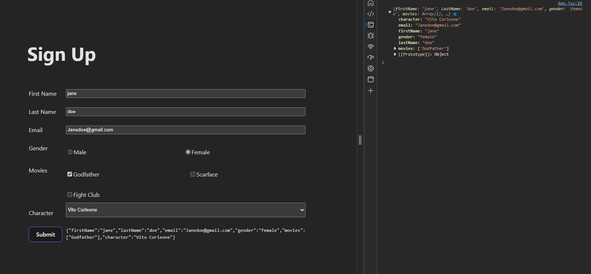

# React with Formik - Sign Up Page

This project contains a sign up page created using React and Formik. It allows users to sign up by filling out a form and logs their answers.

## Screenshots

## Getting Started

To clone the project to your local machine, use the following command:

git clone https://github.com/hasan-ylmz/react-formik.git

Navigate to the project folder:

cd vite-formik

Install the required dependencies:

npm install

To start the development server of the project:

npm start

The application will run at [http://localhost:3000](http://localhost:3000).

## Usage

To visit the sign up page, open the following URL in your browser:

http://localhost:3000/

Fill out the required fields in the form and click the "Sign Up" button. The information filled out in the form will be logged to the console.

## Technologies

This project uses the following technologies:

- React: For building the user interface
- Formik: For form management

